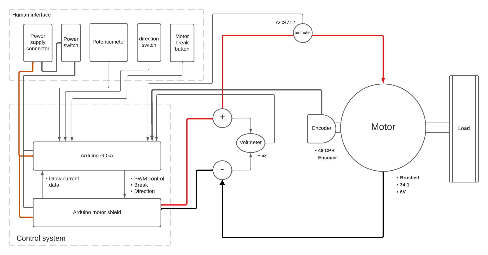
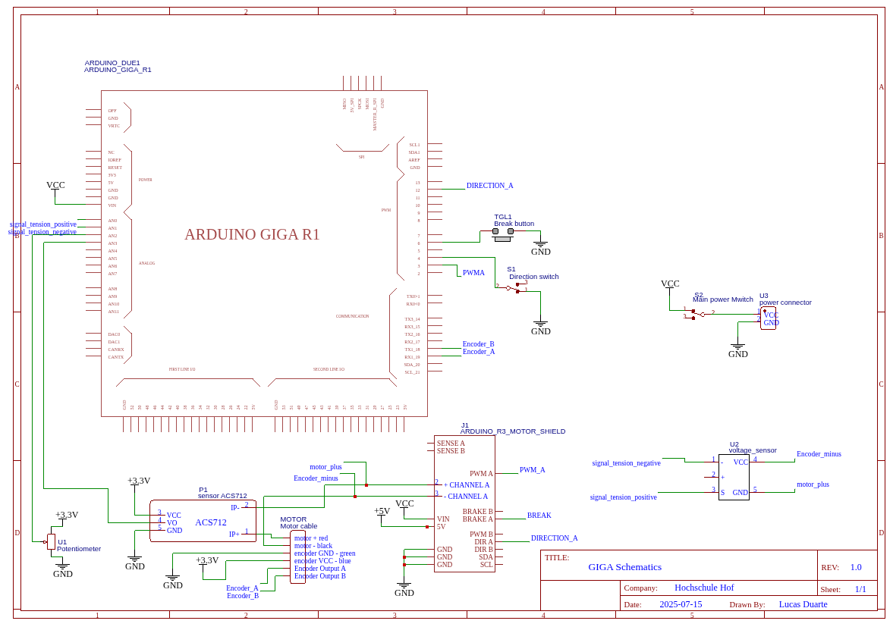

# Real-Time DC Motor Control with Arduino Giga & Mbed OS

 

This project implements a real-time control system for a brushed DC motor using an Arduino Giga R1 board. It leverages the Mbed OS RTOS to manage multiple concurrent tasks, including reading a quadrature encoder, calculating velocity, and controlling the motor based on user input.

## 🌟 Overview

The core of this project is a multi-threaded application that provides precise control over a Pololu gearmotor. It is designed to be a framework for mechatronic application.

The system separates tasks into different threads to ensure that time-sensitive operations (like encoder counting and velocity calculations) are not blocked by less critical ones (like handling user input or serial communication).




### Key Features
* **Multi-threaded Architecture:** Uses Mbed OS (FreeRTOS) to run independent tasks for motor control, velocity measurement, and system health monitoring.
* **Interrupt-Driven Encoder Reading:** Accurately tracks motor position and direction using hardware interrupts, ensuring no ticks are missed even at high speeds.
* **Real-Time Velocity Calculation:** A dedicated task calculates the motor's velocity in revolutions per second (RPS) based on high-precision encoder data.

* **User Interface:** Includes simple HMI components like a potentiometer for speed control, a switch for direction, and a button for braking.
* **Sensor Integration:** Measures the motor's current and voltage in real-time for monitoring and future implementation of closed-loop control.

---

## 🛠️ Hardware Components

| Component | Description | Purpose |
| :--- | :--- | :--- |
| **Controller** | Arduino Giga R1 | Dual-core MCU running Mbed OS for parallel task processing. |
| **Actuator** | Pololu 34:1 Metal Gearmotor 6V | DC motor with a 48 CPR  encoder. |
| **Motor Driver** | Arduino Motor Shield Rev3 | Drives the DC motor with PWM for speed and a digital pin for direction. |
| **Current Sensor**| ACS712-05B | Measures bidirectional current flow to the motor. |
| **Voltage Sensor**| Custom Voltage Divider | Scales motor voltage to be read by the Giga's 3.3V ADC. |
| **HMI** | Potentiometer, Switch, Button | Provides user control for speed, direction, and braking. |



---

## 🔌 Wiring & Connections

The Arduino Motor Shield plugs directly on top of the Arduino Giga. The other components are connected as follows:

### Motor & Encoder
| Component | Pin on Giga | Description |
| :--- | :--- | :--- |
| Motor Terminals | Motor Shield Channel A | Connect the two motor wires to the `+` and `-` terminals. |
| Encoder Channel A | `D18` (Interrupt Pin) | Encoder phase A output. |
| Encoder Channel B | `D19` (Interrupt Pin) | Encoder phase B output. |
| Encoder VCC | `3.3V` | Power for the encoder. |
| Encoder GND | `GND` | Ground for the encoder. |

### Sensors
| Component | Pin on Giga | Description |
| :--- | :--- | :--- |
| Current Sensor (ACS712) | `A3` | Analog output from the sensor. Wired in series with the motor. |
| Voltage Sensor (+) | `A5` | Positive motor terminal voltage (after divider). |
| Voltage Sensor (-) | `A4` | Negative motor terminal voltage (after divider). |

### Human-Machine Interface (HMI)
| Component | Pin on Giga | Description |
| :--- | :--- | :--- |
| Potentiometer | `A2` | Sets the target speed via PWM. |
| Direction Switch | `D4` | Toggles motor direction (HIGH/LOW). |
| Brake Button | `D6` | Engages the motor brake when pressed. |

---
## 🚀 Getting Started

You can get the code running on your board using two methods. The **PlatformIO** method is recommended for development, while the **Arduino IDE** method is the simplest way to just upload the code.

### Method 1: PlatformIO (Recommended)

This project was developed using **PlatformIO**, an open-source ecosystem for IoT development. It is the recommended environment for building and extending the code.

#### Prerequisites
* [Visual Studio Code](https://code.visualstudio.com/)
* [PlatformIO IDE Extension for VSCode](https://platformio.org/install/ide?install=vscode)
* A Git client to clone the repository.

#### Installation Steps

1.  **Clone the Repository:**
    Open your terminal or command prompt and run the following command:
    ```bash
    git clone <your-repository-url>
    ```
    Navigate into the newly created directory:
    ```bash
    cd <repository-name>
    ```

2.  **Open in PlatformIO:**
    * Open Visual Studio Code.
    * Click on the PlatformIO icon on the left-hand sidebar.
    * Under "PIO Home", click "Open Project" and navigate to the folder you just cloned.

3.  **Build and Upload:**
    * Connect your Arduino Giga R1 to your computer via USB.
    * PlatformIO will automatically detect the board and download the necessary frameworks (`arduino`, `mbed`).
    * Click the **Upload** button (→) in the PlatformIO toolbar at the bottom of the window to compile and upload the code.

4.  **Monitor the Output:**
    Click the **Serial Monitor** button (🔌) in the PlatformIO toolbar to view the output. The baud rate is `115200`.

 
### Method 2: Arduino IDE (Simple)

This is the simplest way to get the code onto your Arduino Giga without extra tools.

#### Prerequisites
* [Arduino IDE](https://www.arduino.cc/en/software) installed on your computer.

#### Installation Steps

1.  **Install Giga Board Support:**
    * Open the Arduino IDE.
    * Navigate to **Tools > Board > Boards Manager...**
    * Search for "giga" and install the **Arduino Mbed OS Giga Boards** package.

2.  **Open the Code:**
    * Download the `main.cpp` file from this repository.
    * Rename it to  `main.ino` and include the file in Arduino IDE. It may ask you to create a sketch folder; click **OK**.

3.  **Select Board and Port:**
    * Connect your Arduino Giga R1 to your computer.
    * Go to **Tools > Board** and select **Arduino Giga R1**.
    * Go to **Tools > Port** and select the COM port corresponding to your Giga.

4.  **Upload the Code:**
    * Click the **Upload** button (→) in the top-left corner of the IDE.

5.  **Monitor the Output:**
    * Once the upload is complete, open the **Serial Monitor** (magnifying glass icon in the top-right) and set the baud rate to **115200** to see the output.

## 📂 Code Structure

The entire logic is contained within `src/main.cpp`. The code is organized into several key parts:

* **Global Definitions:** Pin assignments, constants (`TICKS_PER_REVOLUTION`), and global volatile variables for inter-task communication.
* **`setup()`:** Initializes hardware pins, serial communication, and ADC resolution. It also attaches the encoder interrupts and starts the RTOS threads.
* **`loop()`:** This function is empty, as all operations are handled by the Mbed OS tasks.

### RTOS Tasks

* `system_health_task()`: A simple task that blinks the built-in LED every second to provide a visual confirmation that the system is running.
* `measure_velocity_task()`: This task periodically reads the `encoderCount`, calculates the motor's current velocity in RPS, and reads the voltage/current sensors. It runs independently to ensure consistent and timely measurements.
* `drive_control_task()`: Manages the motor's operation. It reads the HMI components (potentiometer, switch, button) and sets the motor's direction, speed (PWM), and brake accordingly.

### Interrupt Service Routine (ISR)

* `handleEncoderChange()`: This function is the core of the position tracking system. It's triggered every time either encoder pin A or B changes state. It reads the pins and implements quadrature decoding logic to increment or decrement the global `encoderCount` variable, correctly determining both rotation amount and direction.

---

## 📈 Future Improvements

This project serves as a strong foundation. The following enhancements are planned:

1.  **Implement Closed-Loop Control:** Develop a full PID (Proportional-Integral-Derivative) controller to precisely regulate the motor's velocity, position, or torque using the real-time sensor feedback.
2.  **Leverage Dual-Core Architecture:** Assign the hard real-time tasks (PID loop, ISR) to the Cortex-M4 core and higher-level logic (sensor fusion, communications) to the powerful Cortex-M7 core for optimal performance.
3.  **Integrate Temperature Sensing:** Add a temperature sensor to the motor casing to monitor its thermal state and prevent overheating during demanding operations.

---

## 📚 References

* **Motor:** [Pololu 34:1 Metal Gearmotor with Encoder](https://www.pololu.com/product/4824)
* **Motor Driver:** [Arduino Motor Shield Rev3 Tutorial](https://docs.arduino.cc/tutorials/motor-shield-rev3/msr3-controlling-dc-motor/)
* **Current Sensor:** [ACS712 Datasheet](https://www.allegromicro.com/-/media/files/datasheets/acs712-datasheet.ashx)
